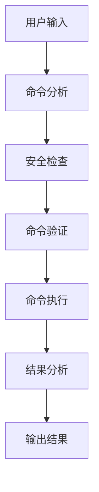

# K8s-Agent (LangGraph版本)

一个基于 LangGraph 的智能 Kubernetes 运维助手，它可以：

1. 理解自然语言的 Kubernetes 运维需求
2. 生成对应的 kubectl 命令
3. 验证命令的安全性和有效性
4. 执行命令并分析结果
5. 提供专业的运维建议

## 特点

- 基于 LangGraph 的 DAG 工作流
- 智能的命令生成和分析
- 完善的安全检查机制
- 专业的结果分析和建议
- 美观的命令行界面

## 安装

1. 克隆仓库：
```bash
git clone <repository-url>
cd k8s-agent-graph
```

2. 创建虚拟环境：
```bash
python -m venv venv
source venv/bin/activate  # Linux/Mac
# 或
.\venv\Scripts\activate  # Windows
```

3. 安装依赖：
```bash
pip install -r requirements.txt
```

4. 配置环境变量：
```bash
cp .env.example .env
# 编辑 .env 文件，填入必要的配置
```

## 使用方法

1. 查看版本：
```bash
python main.py version
```

2. 执行命令：
```bash
python main.py run "获取所有命名空间的pod列表"
```

## 工作流程



## 配置说明

在 `.env` 文件中配置以下参数：

- `OPENAI_API_KEY`: OpenAI API密钥
- `OPENAI_BASE_URL`: OpenAI API基础URL（可选）
- `OPENAI_MODEL`: 使用的模型名称
- `KUBECONFIG_PATH`: kubectl配置文件路径
- `ALLOWED_COMMANDS`: 允许执行的命令列表
- `MAX_RETRIES`: 最大重试次数
- `MAX_TOKENS`: 最大token数
- `TEMPERATURE`: 温度参数
- `LOG_LEVEL`: 日志级别

## 开发说明

项目结构：
```
k8s-agent-graph/
├── src/
│   ├── core/          # 核心功能
│   ├── k8s/           # Kubernetes相关
│   ├── llm/           # LLM相关
│   └── utils/         # 工具函数
├── tests/             # 测试文件
├── docs/              # 文档
├── logs/              # 日志文件
├── main.py           # 主程序
├── requirements.txt   # 依赖文件
└── README.md         # 说明文档
```

## 注意事项

1. 确保已正确配置 kubectl
2. 确保有足够的权限执行相关命令
3. 注意命令的安全性

## 许可证

MIT License 