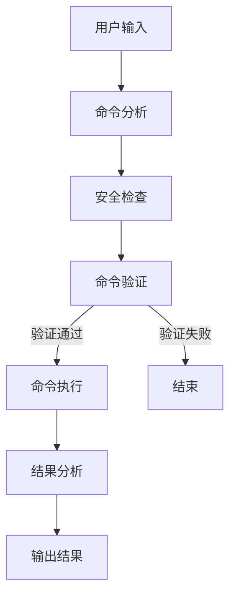

# K8s-Agent-Graph 设计文档

## 1. 项目概述

K8s-Agent-Graph 是一个基于 LangGraph 的智能 Kubernetes 运维助手，通过 DAG（有向无环图）工作流的方式来处理和执行 Kubernetes 运维任务。项目采用模块化设计，将复杂的运维任务拆分为多个独立的处理节点，通过工作流引擎进行协调和执行。

## 2. 系统架构

### 2.1 核心组件

1. **状态管理（State Management）**
   ```python
   class AgentState(TypedDict):
       user_input: str              # 用户输入
       kubectl_help: str           # kubectl帮助文档
       command_analysis: Optional[CommandAnalysis]
       safety_check: Optional[SafetyCheck]
       validation_result: Optional[ValidationResult]
       execution_result: Optional[ExecutionResult]
       result_analysis: Optional[ResultAnalysis]
       error: Optional[str]
       metadata: Dict
   ```

2. **工作流节点（Workflow Nodes）**
   - `analyze_command`: 命令分析节点
   - `check_safety`: 安全检查节点
   - `validate_command`: 命令验证节点
   - `execute_command`: 命令执行节点
   - `analyze_result`: 结果分析节点

3. **客户端模块（Clients）**
   - `K8sClient`: Kubernetes 操作客户端
   - `LLMClient`: LLM 服务客户端

### 2.2 工作流程



## 3. 关键实现

### 3.1 命令处理流程

1. **命令分析**
   ```python
   def analyze_command(state: AgentState) -> AgentState:
       command_analysis = llm_client.analyze_command(
           state["user_input"],
           state["kubectl_help"]
       )
       return {"command_analysis": command_analysis}
   ```

2. **安全检查**
   ```python
   def check_safety(state: AgentState) -> AgentState:
       command = state["command_analysis"].command
       is_safe = k8s_client.is_command_safe(command)
       return {
           "safety_check": {
               "is_safe": is_safe,
               "reason": None if is_safe else "命令不在允许列表中"
           }
       }
   ```

3. **条件路由**
   ```python
   def should_execute(state: AgentState) -> str:
       if state.get("error"): return "end"
       if not state.get("safety_check", {}).get("is_safe"): return "end"
       if not state.get("validation_result", {}).get("is_valid"): return "end"
       return "execute"
   ```

### 3.2 工作流配置

```python
def create_workflow() -> StateGraph:
    workflow = StateGraph(AgentState)
    
    # 添加节点
    workflow.add_node("analyze", analyze_command)
    workflow.add_node("safety_check", check_safety)
    workflow.add_node("validate", validate_command)
    workflow.add_node("execute", execute_command)
    workflow.add_node("analyze_result", analyze_result)
    
    # 设置边和条件
    workflow.add_edge("analyze", "safety_check")
    workflow.add_edge("safety_check", "validate")
    workflow.add_conditional_edges(
        "validate",
        should_execute,
        {
            "execute": "execute",
            "end": END
        }
    )
    
    return workflow.compile()
```

## 4. 数据模型

### 4.1 命令分析模型
```python
class CommandAnalysis(BaseModel):
    command: str
    description: str
    safety_level: str
```

### 4.2 执行结果模型
```python
class ExecutionResult(BaseModel):
    success: bool
    stdout: str
    stderr: str
```

### 4.3 分析结果模型
```python
class ResultAnalysis(BaseModel):
    status: str
    analysis: str
    suggestions: str
```

## 5. 安全机制

1. **命令白名单**
   - 通过环境变量配置允许的命令列表
   - 在执行前进行命令验证

2. **命令验证**
   - 使用 `--dry-run` 进行预检
   - 多层安全检查机制

3. **错误处理**
   - 完整的错误捕获和处理机制
   - 详细的错误日志记录

## 6. 扩展性设计

1. **模块化结构**
   - 核心功能模块化
   - 清晰的接口定义
   - 易于添加新功能

2. **配置驱动**
   - 环境变量配置
   - 可配置的命令白名单
   - 灵活的 LLM 模型选择

3. **工作流扩展**
   - 支持添加新的处理节点
   - 灵活的条件路由
   - 可定制的执行流程

## 7. 最佳实践

1. **代码组织**
   - 清晰的目录结构
   - 模块化的设计
   - 类型提示的使用

2. **错误处理**
   - 异常捕获和处理
   - 详细的错误信息
   - 日志记录

3. **配置管理**
   - 环境变量配置
   - 配置文件模板
   - 敏感信息保护

## 8. 未来改进

1. **功能增强**
   - 支持更多 kubectl 命令
   - 添加批量处理能力
   - 增加命令模板功能

2. **性能优化**
   - 命令执行并行化
   - 结果缓存机制
   - 资源使用优化

3. **安全增强**
   - 更细粒度的权限控制
   - 命令审计功能
   - 安全策略配置 